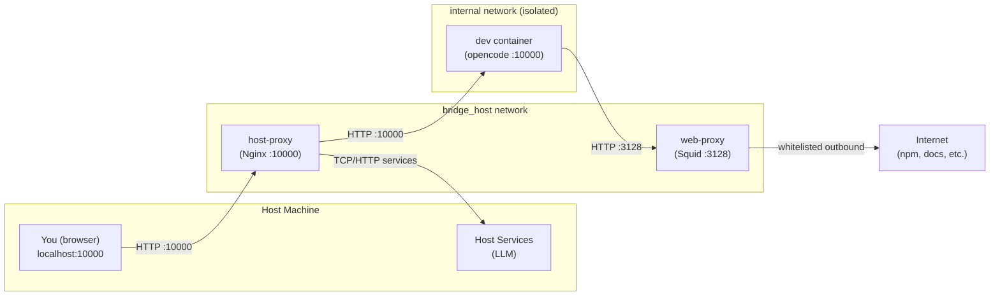
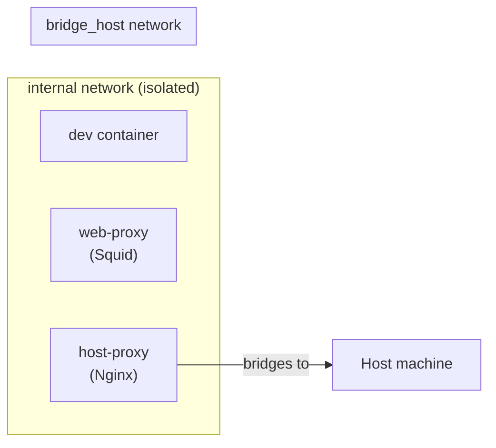
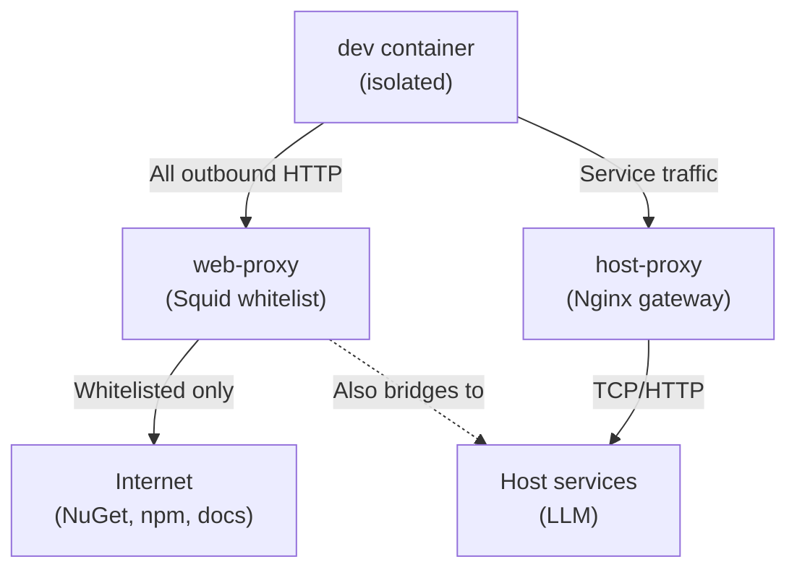

# OpenCode Containerized Development Environment

This directory contains a Docker Compose setup that runs **opencode** (the AI coding assistant) inside an isolated container so it can safely develop against the codebase without direct host access.

## Architecture



## Container Responsibilities

### `dev` — The AI Coding Agent

The primary container. Runs the **opencode** web server that provides the AI coding interface.

| Aspect              | Details                                                                |
| ------------------- | ---------------------------------------------------------------------- |
| **Base image**      | Alpine 3.23 + .NET SDK 10 + Node.js + Git                              |
| **Entrypoint**      | `opencode web --port 10000 --hostname 0.0.0.0`                         |
| **Source mount**    | `../../` → `/source` (full codebase)                                   |
| **Security mounts** | `.git` read-only, config files read-only, `.opencode/container` hidden |
| **Network**         | `internal` only (no direct host access)                                |

**What it does:** The AI agent reads and writes code, executes npm commands, and generates output — all inside this container.

### `web-proxy` — Outbound Traffic Gatekeeper

A **Squid** HTTP/HTTPS proxy that controls all outbound internet traffic from the `dev` container.

| Aspect     | Details                                                 |
| ---------- | ------------------------------------------------------- |
| **Image**  | `ubuntu/squid`                                          |
| **Port**   | 3128 (internal only)                                    |
| **Policy** | Whitelist-only — only known-good domains can be reached |

Any request to a non-whitelisted domain is **denied**. This prevents the AI agent from accidentally (or maliciously) making outbound calls to arbitrary endpoints.

### `host-proxy` — Host Service Gateway

An **Nginx** reverse proxy that bridges the isolated `internal` network with services on the host machine.

| Aspect           | Details                           |
| ---------------- | --------------------------------- |
| **Image**        | `nginx:alpine`                    |
| **Port mapping** | `10000:10000` exposed to host     |
| **Networks**     | Both `internal` and `bridge_host` |

**What it proxies:**

| Protocol         | Host Port                | Service           | Direction              |
| ---------------- | ------------------------ | ----------------- | ---------------------- |
| HTTP + WebSocket | 10000                    | → `dev` container | User ↔ AI agent        |
| HTTP (optional)  | `${LOCAL_LLM_HOST_PORT}` | Local LLM         | AI agent ↔ LLM backend |

The entrypoint script dynamically resolves the host's IP and substitutes variables into the Nginx config at startup.

## Networks



- **`internal`** — Completely isolated. The `dev`, `web-proxy`, and `host-proxy` containers communicate here. No container in this network can reach the internet directly.
- **`bridge_host`** — A Docker bridge network. Only `web-proxy` and `host-proxy` participate. This is the **only** path from the isolated environment to the outside world (host services and internet).

## Security Model



1. The `dev` container has **no direct network access** to the host or internet.
2. All HTTP/HTTPS outbound traffic must pass through `web-proxy`, which enforces a strict domain whitelist.
3. Host services (LLM) are only reachable via `host-proxy`, which routes traffic through the `bridge_host` network.
4. The `.git` directory is mounted **read-only** to prevent tampering with version history.
5. The entire `.opencode/container` config is hidden behind a non-existent mount to keep it invisible to the AI agent.

## Running with a Rooted Docker Daemon

By default, the container runs as `root` internally, which is safe when the Docker daemon itself is **rootless** (e.g. Podman, Docker rootless mode). If you're running a traditional **rooted** Docker daemon, you should drop to a non-root user inside the container to harden against privilege escalation.

### Dockerfile changes

Add build args for UID/GID and create a non-root user:

```dockerfile
# Pass the host user's UID and GID to align file permissions on the /source mount
ARG UID=1000
ARG GID=1000

# After installing packages, create a non-root user
RUN addgroup --gid $GID opencodegroup
RUN adduser -D -u $UID -G opencodegroup opencodeuser

USER opencodeuser

# Global npm packages need a user-writable prefix
RUN npm config set prefix '~/.local/'
ENV PATH="/home/opencodeuser/.local/bin:/home/opencodeuser/.dotnet/tools:${PATH}"
```

Replace the existing root-targeted `ENV PATH="/root/..."` line with the user-scoped one above.

### docker-compose.yaml changes

Pass the host user's UID/GID as build args:

```yaml
build:
  context: .
  dockerfile: ./Dockerfile
  args:
    - UID=${UID:-1000}
    - GID=${GID:-1000}
```

### Notes

- The `WORKDIR /source` directive should appear **after** `USER opencodeuser` so the directory is created with correct ownership (though the bind mount overrides ownership at runtime).
- The `dotnet tool install --global` and `npm i -g` commands must run **after** `USER` so tools install into the user's home directory.
- The `security_opt: no-new-privileges:true` and `cap_drop: ALL` settings in docker-compose.yaml apply regardless of rooted/rootless mode.

## Usage

```bash
# Start the stack
podman compose -f docker-compose.yaml up -d

# Stop the stack
podman compose -f docker-compose.yaml down

# View logs
podman compose -f docker-compose.yaml logs -f
```

Then open your browser to **http://localhost:10000** to access the OpenCode AI coding interface.

## Environment Variables

Sensitive variables are loaded from `.env` (not checked into source control):

| Variable              | Purpose                                         |
| --------------------- | ----------------------------------------------- |
| `LOCAL_LLM_HOST_PORT` | (Optional) Port of a local LLM backend to proxy |

## Per-User Configuration

Opencode uses a layered config system mounted read-only into the container:

| File                            | Mount Path                        | Purpose                                                                                 |
| ------------------------------- | --------------------------------- | --------------------------------------------------------------------------------------- |
| `.opencode/opencode.base.json`  | `/source/opencode.json`           | Shared project-wide config (instructions, skills, agents) — committed to source control |
| `.opencode/opencode.local.json` | `/source/.opencode/opencode.json` | Per-user overrides (model, provider, etc.) — **not** committed to source control        |

The `opencode.local.json` file lets each developer customize their own experience without affecting teammates. For example, to use a different local LLM or provider.

Any opencode config field supported in `opencode.base.json` can be overridden in `opencode.local.json`. The local file takes precedence for matching keys.
